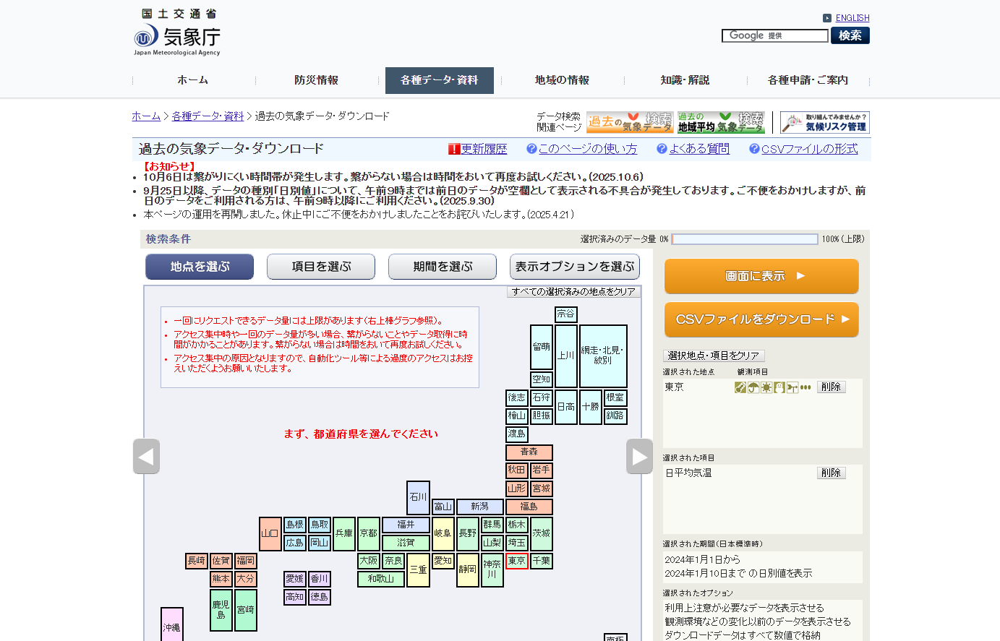
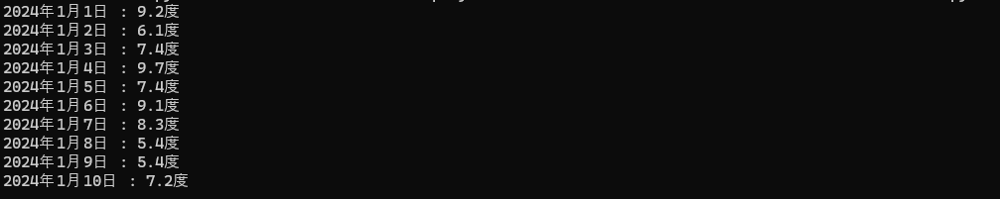

# weather_report
気象庁の過去のデータをスクレイピングで抽出

# はじめに
PythonのSeleniumを使用した静的サイトの自動操作方法について知るために参考になりそうなものを実際に書いて実行できるか確認してみることにしました。

# 使用技術など
言語：Python
Selenium:サイトの呼び出し、自動操作  
Google chrome：今回使用したブラウザ

# 実行イメージ
※スクレイピングを使用する際は対象のサイトがスクレイピングが可能かきちんと確認すること
また過度にサイトをアクセスして負荷をかけないように注意して作成すること

対象の気象庁の過去データのページ

無事に出力された

# 参考リンクなど
学習しての課題や問題点などは[Qiitaの記事](https://qiita.com/dorayaki800/items/9fd3a0496902a8df1677)に書きました。
スクリプトの作成にあたっては[こちら](https://youtu.be/AfQtnA5umn8?si=tb17vapuB2vOOMMe)を参考にしました。

